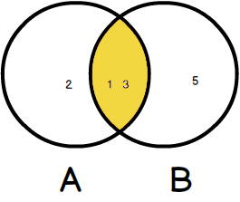
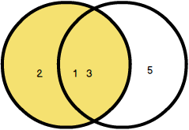

# 3. SQL SELECT queries with JOIN - where data is in two or more related tables

## SQL JOINs

For these queries you will need to use JOINs.

In the data preparation activities in week 2 you were introduced to the DataFrame merge function that joined two sets of
data based on a common column.

The same principle is used in databases to join tables, with slightly different syntax.

| Join type                                                       | Venn diagram                                    | Description                                                                                                                                                                                                                                                     |
|:----------------------------------------------------------------|:------------------------------------------------|:----------------------------------------------------------------------------------------------------------------------------------------------------------------------------------------------------------------------------------------------------------------|
| [INNER JOIN](https://www.sqlitetutorial.net/sqlite-inner-join/) |  | Selects all rows from both tables to appear in the result if and only if both tables meet the conditions specified in the ON clause.                                                                                                                            |
| [LEFT JOIN](https://www.sqlitetutorial.net/sqlite-left-join/)   |    | Select results include:<br>Rows in table A (left table) that have corresponding rows in table B.<br>Rows in the table A table and the rows in the table B filled with NULL values in case the row from table A does not have any corresponding rows in table B. |
| [CROSS JOIN](https://www.sqlitetutorial.net/sqlite-cross-join/) |                                                 | Produces a Cartesian product of two tables; multiplying each row of the first table with all rows in the second table if no condition introduced with CROSS JOIN.                                                                                               |

RIGHT OUTER JOIN and FULL OUTER JOIN are not supported in SQLite.

Run the example queries in the following
file: [tutorial8_queries.py](../../src/tutorialpkg/week8_queries/select_queries.py). You may need to remove the # from the line in 'main' that includes `run_chinook_select_join_queries()` and add # before the line with `run_chinook_select_queries()`.

```sqlite
-- 7. LEFT JOIN: Find the artists who do not have any albums
-- use the . notation to reference the table where an attribute appears in more than one table
SELECT artists.Name, AlbumId
FROM artists
    LEFT JOIN albums ON albums.ArtistId = artists.ArtistId
WHERE
   AlbumId IS NULL;

-- 8. INNER JOIN: Find all track names, album and artist name where the artist name begins with 'Z'
--  One track belongs to one album and one album have many tracks. 
--  The tracks table associated with the albums table via albumid column.
--  One album belongs to one artist and one artist has one or many albums. 
--  The albums table links to the artists table via artistid column.
SELECT
    tracks.name AS track,
    albums.title AS album,
    artists.name AS artist
FROM
    tracks
    INNER JOIN albums ON albums.albumid = tracks.albumid
    INNER JOIN artists ON artists.artistid = albums.artistid
WHERE
    artists.name LIKE 'Z%';

--  9. CROSS JOIN: This returns the cartesian product. I could not think of a meaningful example from chinook so the 
--  example is from the SQLIte tutorial
-- Use CROSS JOIN to create a deck of cards.
SELECT rank, suit
FROM ranks
  CROSS JOIN suits
ORDER BY suit;
```

Now write queries to find the following from the para_queries database:

1. Find all disability categories from the 'Disability' table and sort them in alphabetical order.
2. Find the unique 'region' names from the 'Country' table.
3. Find the start and end dates of all events that occured in years between 1960 and 1969.
4. Find 5 country codes from the 'Host' table.
5. Find the event_id and number of teams in the MedalResult table for each.
6. Find the event_id and number of teams in the MedalResult table for event with event_id 27.
7. Find the event name and number of teams in the MedalResult table for event with event_id 24.
8. Find the year, host name, number of male participants and number of female participants in all winter games.
9. Find the results for the Faroe Islands showing the year, event name, event type and their medal result rank.
10. Find the events that included the disability category 'Intellectual Disability' and sort them in alphabetical order.

Try and think of some of your own questions to ask then write the queries.

[Next activity](8-4-insert.md)
